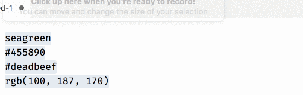

   

<!--  -->

# VSCode Change Color Format

Quickly transform any color format into another color format. Useful for transform computer-friendly RGB into human-friendly HSL.

Simply select one or more colors and activate the extension.

Formats supported by this extension:

- color names ('seagreen', 'darkgrey')
- #RGB, #RRGGBB
- #RGBA, #RRGGBBAA ([not supported by IE](https://caniuse.com/#feat=css-rrggbbaa))
- rgb(), rgba()
- hsl(), hsla()

> NOTE: Transforming between color formats may result in slightly different code because of differences in color space. Visually it is undetectable.

## Motivation

HSL is a much more readable color format for humans than rgb/hex. After a little practice, you can tell at a glance approximately what a color will look like. If I see `hsl(43, 74%, 49%)`, I know right away is a strongly saturated mid-brightness yellowish color. The equivalent color in RGB is `#DAA520`, which takes time to think about and parse, even with 20+ years of experience.

HSL is also really useful for creating spectrums of similar colors easily. Here is what HSL looks like compared to RGB for a color spectrum generated by the amazing [colorbox.io](https://www.colorbox.io/#steps=11#hue_start=86#hue_end=86#hue_curve=easeInQuad#sat_start=2#sat_end=98#sat_curve=linear#sat_rate=99#lum_start=100#lum_end=11#lum_curve=easeOutQuad#minor_steps_map=5). Notice how it's impossible to tell that the rgb colors are related, but it's really obvious in the HSL because it's all nearly the same hue. You can also compare them and see the lightness goes from low to high. Making subtle tweaks to color palettes is super easy with HSL.

| rgb     | hex                |
| ------- | ------------------ |
| #101C01 | hsl(87, 93%, 6%)   |
| #2C4709 | hsl(86, 78%, 16%)  |
| #4A7019 | hsl(86, 64%, 27%)  |
| #68952F | hsl(86, 52%, 38%)  |
| #85B349 | hsl(86, 42%, 49%)  |
| #A0CB67 | hsl(86, 49%, 60%)  |
| #B7DE85 | hsl(86, 57%, 70%)  |
| #CCEBA3 | hsl(86, 64%, 78%)  |
| #DFF5C1 | hsl(85, 72%, 86%)  |
| #EFFBDE | hsl(85, 78%, 93%)  |
| #FDFFFA | hsl(84, 100%, 99%) |

## Release Notes

See [CHANGELOG.md](CHANGELOG.md).

## Contributing

Please see [CONTRIBUTING.md](CONTRIBUTING.md).

## License

The `vscode-change-color-format` library is available as open source under the terms of the
[MIT License](http://opensource.org/licenses/MIT). See the [LICENSE](LICENSE) file for the specifics.

## Credits

- This extension uses the excellent [`color`](https://www.npmjs.com/package/color) package by Qix.
- The icon is from [IconFinder](https://www.iconfinder.com/icons/67268/color_settings_icon)/[Iconshock](https://www.iconshock.com/)
